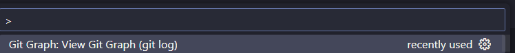
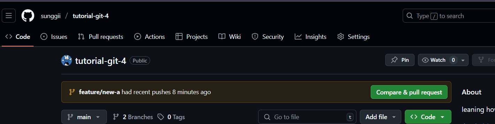
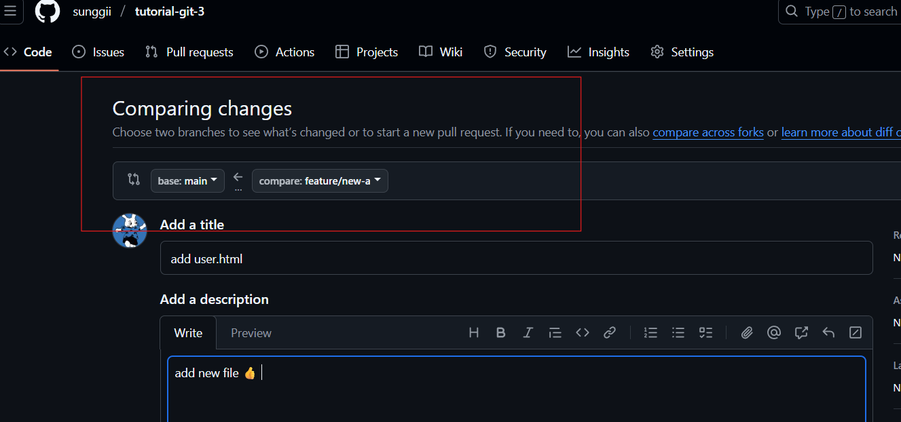

# What I learned
ref: [doc พี่ไมค์](https://docs.mikelopster.dev/c/basic/git/intro)

## Git Graph
* เป็น extention โหลดมาดู Graph แทน sourcetree
* วิธีดู Graph 
    1.  ```Ctrl + shift + p```
    2. เลือก

    

## คำสั่งพื้นฐาน
* ```git init```
* ```git add ``` and ```git commit``` ทำผ่าน UI

## คำสั่ง Branch
* ```git branch``` ใช้เช็ค branch ที่ทำงานอยู่
* ```git branch -m <ชื่อใหม่>```
* ```git merge <deverlop>``` คือ merge develop เข้า main
    * หลัง merge ให้พิม ```:wq``` ที่ terminal เพื่อออก
* ```feature/<ชื่อfeature>``` นิยมใช่ / ตอนทำ feature ใหม่

## Git server และคำสั่ง remote
* หลังจาก cop remote ให้ใช้ ```git push --all  origin``` เพื่ออัพทุก branch ขึ้น github
* ```git push <ตัวแปร> <branch ที่จะ push>``` **ตัวอย่าง** ```git push origin main```
* ```git pull <ตัวแปร> <branchที่จะ pull>``` **ตัวอย่าง** ```git pull origin main```
    * ให้ดึงอัพเดทล่าสุดของ server เข้า file
* ```git fetch origin``` ใช้ดึงทุก branch เข้ามา

# How to pull request
* ตอนทำงานจริงให้ทำแบบนี้แทนการ merge branch ตัวเอง เข้า main มั่วซั่ว
* pull request เกิดจากการอัพงานจาก branch ตัวเอง ขึ้น github

1. กด compare


2. ดูครงนี้ให้ดี
